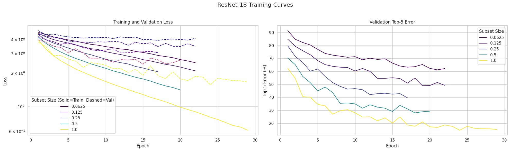

# AlexNet and ResNet18 on Mini-ImageNet

This project contains a modular PyTorch pipeline to train and evaluate AlexNet and ResNet18 models on the Mini-ImageNet dataset. The primary goal is to analyze the relationship between the size of the training dataset and the model's performance, specifically by plotting the Top-5 error rate against varying data subset sizes.

## Overview

The project implements the following workflow:
1.  **Data Subsetting**: The Mini-ImageNet training dataset is sampled into geometrically smaller subsets (e.g., 100%, 50%, 25%, etc.) while preserving class balance.
2.  **Training**: A model (AlexNet or ResNet18) is trained from scratch on each of these subsets. Training progress, logs, and model checkpoints are saved.
3.  **Evaluation**: The best checkpoint from each training run is evaluated on the test set to measure performance metrics like Top-1 and Top-5 error.
4.  **Visualization**: The final results are used to plot learning curves, such as Top-5 error versus the training set size, to analyze the model's sample efficiency.

## Features

- **Models**: Supports `AlexNet` and `ResNet18`.
- **Data Handling**: Uses the `timm/mini-imagenet` dataset from the Hugging Face Hub and provides utilities for stratified subset sampling.
- **Modular Structure**: Code is organized into distinct modules for data loading, models, training, and evaluation.
- **Reproducibility**: Saves training checkpoints, logs, and evaluation metrics for each run.
- **Visualization**: Includes a Jupyter notebook to visualize the results and generate performance plots.

## Directory Structure

```
.
├── checkpoints/          # Saved model checkpoints
├── eval.py               # Main script for evaluating models
├── logs/                 # Training logs (metrics per epoch)
├── notebooks/
│   ├── eda.ipynb         # Notebook for exploratory data analysis
│   └── results.ipynb     # Notebook for visualizing results
├── output/
│   ├── alexnet_curve.png
│   └── resnet18_curve.png
├── plan.md               # Detailed project plan
├── results/              # Evaluation results (JSON files)
├── src/                  # Source code
│   ├── data/             # Data loading and preprocessing
│   ├── evaluation/       # Evaluation logic and results handling
│   ├── models/           # Model definitions (AlexNet, ResNet18)
│   └── training/         # Trainer, validator, and checkpointing logic
└── train.py              # Main script for training models
```

## Dataset

The project uses the **Mini-ImageNet** dataset, a smaller, more manageable subset of the full ImageNet dataset.
- **Source**: `timm/mini-imagenet` on Hugging Face Hub.
- **Classes**: 100 distinct classes.
- **Splits**: 50,000 training images, 10,000 validation images, and 5,000 test images.
- **Preprocessing**: All images are resized to 227x227 pixels to match the input size of the models.

## Requirements

This project uses standard deep learning libraries. You can install them by creating and using a `requirements.txt` file.

```txt
torch
torchvision
huggingface-hub
tqdm
numpy
matplotlib
scikit-learn
```

Install the requirements using pip:
`pip install -r requirements.txt`

## Usage

### 1. Training

The `train.py` script is the entry point for training models. You can specify the model architecture, data subset sizes, and other hyperparameters.

**Command:**
```bash
python train.py --model [MODEL_NAME] --subset-sizes [SIZES...] --num-epochs [EPOCHS] --learning-rate [LR]
```

**Arguments:**
- `--model`: Model to train (`alexnet` or `resnet18`).
- `--subset-sizes`: A list of floats representing the fraction of the training data to use.
- `--num-epochs`: Number of training epochs.
- `--learning-rate`: Learning rate for the optimizer.
- `--batch-size`: Training batch size.
- `--checkpoint-dir`: Directory to save checkpoints. A new subfolder is created for each run.

**Example:**
To train an AlexNet model on 100%, 50%, and 25% of the data for 90 epochs:
```bash
python train.py \
    --model alexnet \
    --subset-sizes 1.0 0.5 0.25 \
    --num-epochs 90 \
    --learning-rate 0.01 \
    --batch-size 128
```
Checkpoints will be saved to a directory like `checkpoints/alexnet/20231027_120000/`.

### 2. Evaluation

After training, use the `eval.py` script to evaluate the best checkpoints on the test set.

**Command:**
```bash
python eval.py --model [MODEL_NAME] --checkpoint-dir [PATH_TO_RUN_CHECKPOINTS]
```

**Arguments:**
- `--model`: Model to evaluate (`alexnet` or `resnet18`).
- `--checkpoint-dir`: Path to the specific run directory containing the checkpoints (e.g., `checkpoints/alexnet/20231027_120000/`).

**Example:**
```bash
python eval.py \
    --model alexnet \
    --checkpoint-dir checkpoints/alexnet/20231027_120000/
```
The script will automatically find all `subset_*` directories, load the best checkpoint for each, run evaluation, and save the final metrics to the `results/` directory as a JSON file.

### 3. Visualizing Results

The `notebooks/results.ipynb` notebook can be used to load the JSON files from the `results/` directory and generate plots, such as the Top-5 error vs. data size curve.

## Results

The training and evaluation pipeline produces the following key outputs:
- **Checkpoints**: Saved for each subset in the `checkpoints/` directory.
- **Logs**: Detailed epoch-by-epoch metrics stored in the `logs/` directory.
- **Final Metrics**: A summary JSON file in the `results/` directory containing the test set performance for each subset size.

The analysis of these results demonstrates the relationship between data availability and model performance.

### Performance Curves

Below are the performance curves showing Top-5 Error vs. Training Set Size for AlexNet and ResNet18.

**AlexNet**


**ResNet18**

